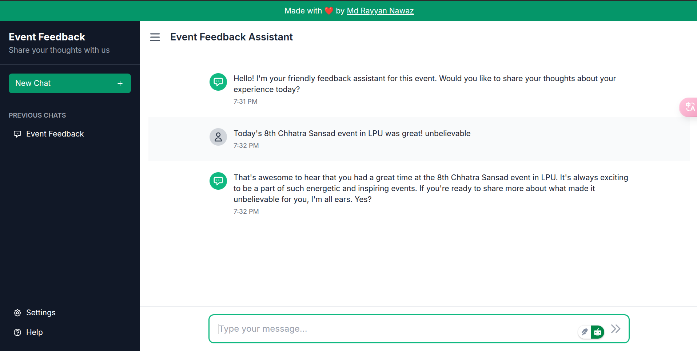

# Event-FeedBack Chatbot

A modern, AI-powered chatbot solution for collecting and analyzing event feedback in real-time.

## Overview

Event-FeedBack is a conversational AI system designed to transform how event organizers collect and analyze attendee feedback. Traditional feedback methods often suffer from low response rates and delayed submissions. This chatbot solution addresses these problems by creating an engaging, conversational experience that feels more like a dialogue than a survey.



## Key Features

- **AI-Powered Conversations**: Engage attendees with natural dialogue using Groq's LLama 3.3 70B model
- **Real-Time Feedback Collection**: Gather insights during or after events
- **Dark Mode Support**: Enhanced user experience with light and dark themes
- **Settings Customization**: User-configurable options including language, sound notifications, and appearance
- **Comprehensive Help Center**: In-app documentation and support resources
- **Offline Capability**: Works even without internet connection using fallback responses
- **Analytics Dashboard**: Visualize feedback with actionable insights
- **Responsive Design**: Works seamlessly across desktop and mobile devices
- **MongoDB Integration**: Secure and scalable data storage
- **Multi-Language Support**: Internationalization ready with language selection

## Technologies Used

- **Frontend**: Next.js, React, TypeScript, Tailwind CSS
- **Backend**: Node.js, Express, MongoDB
- **AI Integration**: Groq API (LLama 3.3 70B model)
- **Authentication**: JWT-based secure authentication
- **Storage**: MongoDB for feedback data and user information
- **Styling**: Tailwind CSS with dark mode support

## Architecture

The system consists of five core components:
1. **User Interface**: Chat window accessible via multiple platforms
2. **AI Engine**: LLM-powered conversation flow using Groq API
3. **Input Validation Module**: Ensures response accuracy
4. **Database**: MongoDB for storing feedback and conversation data
5. **Analytics Interface**: Provides reporting and visualizations

## Getting Started

### Prerequisites
- Node.js (v16 or higher)
- MongoDB (v4.4 or higher)
- npm or yarn
- Groq API key (for AI functionality)

### Installation
```bash
# Clone the repository
git clone https://github.com/therayyanawaz/Event-FeedBack.git

# Navigate to the project directory
cd Event-FeedBack

# Install dependencies
npm install

# Set up environment variables
cp .env.example .env
# Edit .env with your Groq API key and MongoDB connection string

# Start the development server
npm run dev
```

### Deployment

This project is optimized for deployment on Vercel. For detailed instructions on how to deploy this application to Vercel, please see the [Vercel Deployment Guide](VERCEL_DEPLOYMENT.md).

Key deployment features:
- Optimized for serverless functions
- Proper runtime configuration for MongoDB compatibility
- Detailed environment variable setup instructions
- Troubleshooting tips for common deployment issues

## Usage

1. **Configure Your Event**: Set up event details in the admin dashboard
2. **Customize Questions**: Define your feedback questions and conversation flow
3. **Deploy**: Make the chatbot available through your preferred channels
4. **Monitor**: View real-time feedback and analytics during your event
5. **Analyze**: Use the insights dashboard to review compiled feedback after the event

## Features in Detail

### AI Conversations
The chatbot uses Groq's LLama 3.3 70B model to provide natural, context-aware responses. If the API is unavailable, the system falls back to static responses.

### Dark Mode
Users can toggle between light and dark themes in the settings panel, with preferences saved between sessions.

### Settings Panel
The comprehensive settings panel allows users to:
- Toggle dark mode
- Enable/disable sound notifications
- Change interface language
- Clear conversation history

### Help Center
The built-in help center provides:
- Information about the application
- Usage instructions
- Frequently asked questions
- Contact support details

## Project Structure

```
Event-FeedBack/
├── app/                # Application source code
│   ├── api/            # API routes and controllers
│   ├── components/     # React components
│   │   ├── Chat.tsx    # Main chat interface
│   │   ├── Message.tsx # Message bubbles
│   │   ├── Settings.tsx# Settings modal
│   │   └── Help.tsx    # Help documentation
│   ├── models/         # MongoDB schemas
│   ├── pages/          # Application pages
│   ├── utils/          # Utility functions
│   │   └── groqApi.ts  # Groq API integration
├── public/             # Static assets
│   └── sounds/         # Sound notification files
├── .env                # Environment variables
├── CHANGELOG.md        # Detailed version history
└── README.md           # Project documentation
```

## Development Roadmap

- **Phase 1**: Core chatbot functionality and basic web interface
- **Phase 2**: Advanced NLP for better understanding of free-text responses
- **Phase 3**: Integration with popular event platforms
- **Phase 4**: Extended analytics and reporting features

## Changelog

For a detailed history of changes and version updates, please see the [CHANGELOG.md](CHANGELOG.md) file. The changelog documents the evolution of the project from its initial release through all major feature additions and improvements.

## Contributing

Contributions are welcome! Please feel free to submit a Pull Request.

## License

This project is licensed under the MIT License - see the [LICENSE](LICENSE) file for details.

## Author

- **[Md Rayyan Nawaz](https://github.com/therayyanawaz)** - *Initial work*

## Acknowledgments

- Special thanks to all contributors
- Powered by Groq's LLama 3.3 70B model